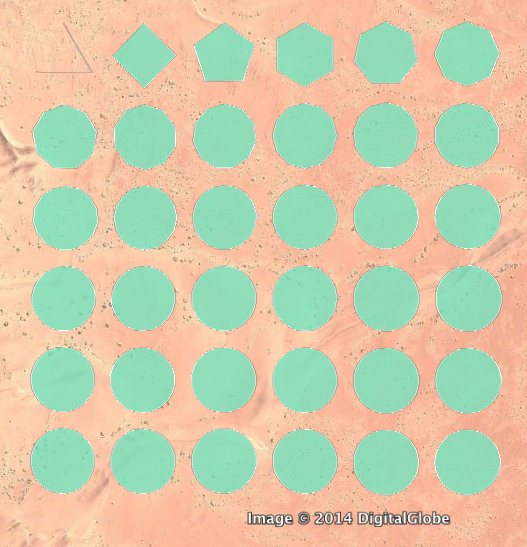

.. _background:

Theory and background
=====================

The right number of vertices
----------------------------

Raising the number of vertices makes the polygon illusion more compelling.
On the other side, too many vertices make the KML file larger and Google Earth slower.

In my opinion, 36 edges are the right balance between appearances and file size.

