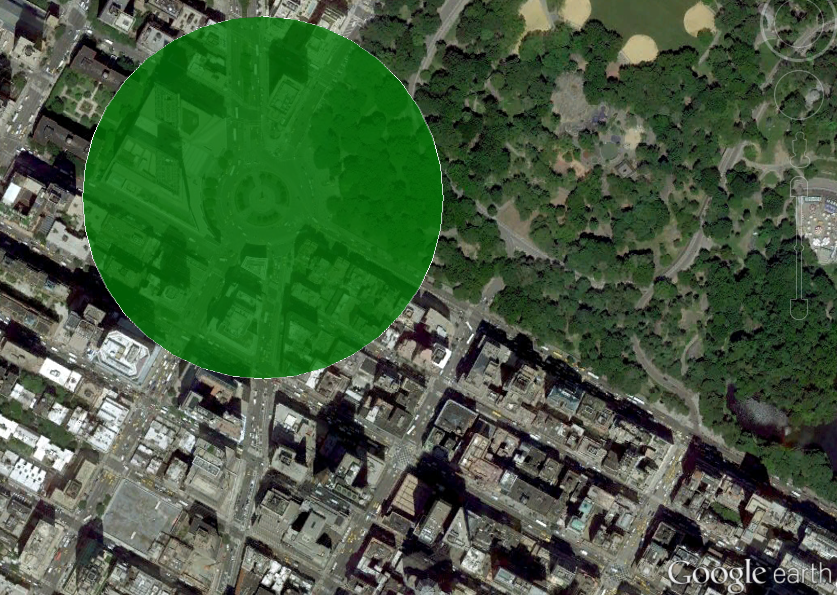

.. _gettingStarted:

Getting started
===============

Installing
----------

.. code:: bash

	pip install polycircles

Useage
------

This library uses WGS84 coordinates. Lattitude, longitude and ellipse orientation are in decimal degrees, distances are in meters. 

Class:

    polycircle.Polycircle(latitude, longitude, radius, number_of_vertices=36)

    polycircle.Polyellipse(latitude, longitude, semimajor, semiminor, orientation=0, number_of_vertices=36)

Methods:

These methods apply to both classes.

    to_lat_lon(): Returns a tuple of (lat, lon) tuples of the polygon.
    
    to_kml(): Returns a tuple of (lon, lat) tuples suitable for a KML polygon.
    
    to_wkt(): Returns a WKT (Well Known Text) representation of the polygon. Note that WKT tuples are (lon, lat), not (lat, lon).
    
    to_lon_lat(): Returns a tuple of (lon, lat) tuples of the polygon. The (lon, lat) notation is used in KMLs and WKTs.
    
.. note:: The number of vertices must be passed as an integer.     
    
Your first KML circle
---------------------

Generates a circle approximation readable by `simpleKML`_.

.. _simpleKML : https://code.google.com/p/simplekml/

.. code:: python

	from polycircles import polycircles

	polycircle = polycircles.Polycircle(latitude=40.768085,
	                                    longitude=-73.981885,
	                                    radius=200,
	                                    number_of_vertices=36)
	kml = simplekml.Kml()
	pol = kml.newpolygon(name="Columbus Circle, Manhattan",
						 outerboundaryis=polycircle.to_kml())
	pol.style.polystyle.color = \
		simplekml.Color.changealphaint(200, simplekml.Color.green)
	kml.save("test_kml_polygon_3_manhattan.kml")

Note that a polygon with 36 vertices looks pretty much like a circle:

   A Polycircle above Columbus Square, Columbus Square, Manhattan, NYC, United States

   Image: Google Earth, Credit: `Google`_

   .. _Google : http://www.google.com/permissions/geoguidelines/attr-guide.html

Sequence of lat-lon points
--------------------------

``polycircles`` can simply generate a series of lat-lon tuples, for any non-KML
usage.

.. code:: python

	import pprint
	from polycircles import polycircles
	polycircle = polycircles.Polycircle(latitude=32.074523,
	                                    longitude=34.791469,
	                                    radius=20,
	                                    number_of_vertices=12)
	pprint.pprint(polycircle.to_lat_lon())
	((32.07470336197859, 34.791469),
	 (32.074679198011374, 34.7915749137218),
     ...
	 (32.074613180857156, 34.79128555218445),
	 (32.074679198011374, 34.791363086278196))
