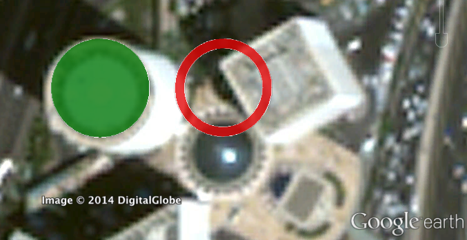

.. Polycircles documentation master file, created by
   sphinx-quickstart on Mon Apr 21 13:22:59 2014.
   You can adapt this file completely to your liking, but it should at least
   contain the root `toctree` directive.

Welcome to Polycircles's documentation!
=======================================

Polycircles is a Pythonic tool for creating accurate Polygonic approximations of circles on a WGS-84 earth grid.

.. image:: _static/kml_manhattan.png
   :height: 300 px
   :alt: Polygon circle in Google Earth. Image Credit: Google
   :align: center

.. image:: _static/kml_rio.png
   :scale: 50%
   :alt: Polygon circle in Google Earth. Image Credit: Google
   :align: center
Contents:

.. toctree::
   :maxdepth: 2

Simple example
--------------

Indices and tables
==================

* :ref:`genindex`
* :ref:`modindex`
* :ref:`search`

