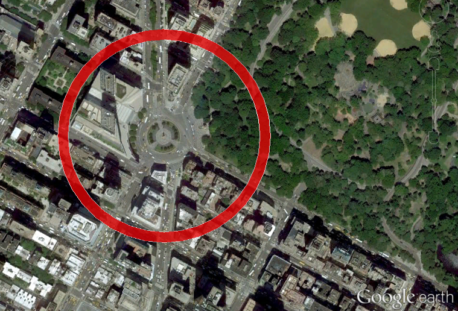
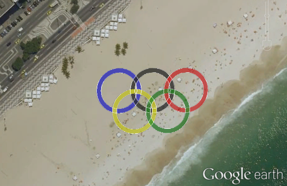

.. _kml-circles:

KML circles
===========

Basic KML circle
----------------

Generates a circle approximation readable by `simpleKML`_.

.. _simpleKML : https://code.google.com/p/simplekml/

.. code:: python

	from polycircles import polycircles

	polycircle = polycircles.Polycircle(latitude=40.768085,
	                                    longitude=-73.981885,
	                                    radius=200,
	                                    number_of_vertices=36)
	kml = simplekml.Kml()
	pol = kml.newpolygon(name="Columbus Circle, Manhattan",
						 outerboundaryis=polycircle.to_kml())
	pol.style.polystyle.color = \
		simplekml.Color.changealphaint(200, simplekml.Color.green)
	kml.save("test_kml_polygon_3_manhattan.kml")

Note that a polygon with 36 vertices looks pretty much like a circle:

.. image:: _static/kml_manhattan.png
   :height: 300 px
   :alt: Polygon circle in Google Earth. Image Credit: Google
   :align: center

Donuts!
-------

Using the ``innerboundaryis`` of `simpleKML`_ Polygon object and two polycircles,
a donut-shape can be easily created:

.. _simpleKML : https://code.google.com/p/simplekml/

.. code:: python

	outer_polycircle = polycircles.Polycircle(latitude=40.768085,
	                                          longitude=-73.981885,
	                                          radius=200,
	                                          number_of_vertices=36)
	inner_polycircle = polycircles.Polycircle(latitude=40.768085,
	                                          longitude=-73.981885,
	                                          radius=180,
	                                          number_of_vertices=36)

	kml = simplekml.Kml()
	pol = kml.newpolygon(name="Torus around Columbus Circle, Manhattan",
						 outerboundaryis=outer_polycircle.to_kml(),
						 innerboundaryis=inner_polycircle.to_kml())
	pol.style.polystyle.color = \
		simplekml.Color.changealphaint(200, simplekml.Color.red)
	kml.save("test_kml_polygon_2_torus_manhattan.kml")

Or even:

